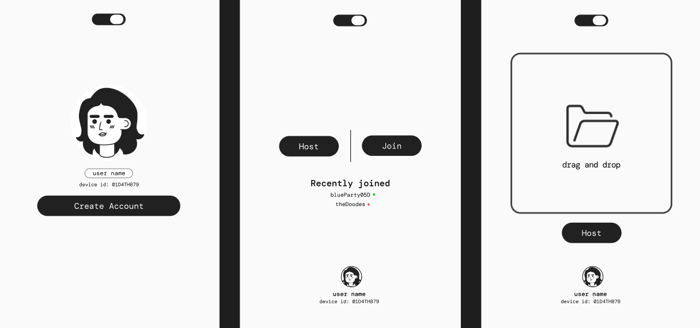

# Co-Binge

A minimal, modern movie-browsing interface built with **SvelteKit** and designed to feel like a lightweight streaming platform UI.

The project focuses on **smooth transitions, responsive layouts, and a clean viewing experience** while exploring modern web and desktop tooling.

Co-Binge recreates the experience of navigating a streaming service while maintaining a **small, readable, and modular codebase**.

---

# Preview



*(Replace with screenshots from your application)*

---

# Tech Stack

## Core Technologies

<p>

</p>

| Technology     | Description                                           |
| -------------- | ----------------------------------------------------- |
| **SvelteKit**  | Full-stack framework used to build the UI and routing |
| **Svelte**     | Reactive UI framework powering the components         |
| **JavaScript** | Application logic                                     |
| **HTML5**      | Page structure and semantic layout                    |
| **CSS3**       | Styling and responsive design                         |
| **Rust**       | Native backend layer used through Tauri               |

---

## Runtime & Platform

<p>

</p>

| Tool        | Purpose                                               |
| ----------- | ----------------------------------------------------- |
| **Node.js** | Development runtime                                   |
| **Tauri**   | Desktop app framework for packaging the app with Rust |

---

## Development Tools

<p>

</p>

| Tool        | Purpose                         |
| ----------- | ------------------------------- |
| **Git**     | Version control                 |
| **GitHub**  | Code hosting                    |
| **VS Code** | Primary development environment |

---

# Features

* Smooth page transitions
* Dark mode toggle
* Streaming-style interface
* Responsive layout
* Modular Svelte components
* Custom movie card UI
* Device identifier display
* Back navigation system
* Lightweight frontend architecture

---

# Project Structure

```
co-binge
│
├── src
│   ├── routes
│   │   ├── +layout.svelte
│   │   ├── +page.svelte
│   │
│   ├── lib
│   │   ├── assets
│   │   ├── components
│   │
│   └── style.css
│
├── static
│
├── src-tauri
│   └── Rust backend
│
├── package.json
└── README.md
```

---

# Installation

Clone the repository

```bash
git clone https://github.com/yourusername/co-binge.git
```

Navigate into the project

```bash
cd co-binge
```

Install dependencies

```bash
npm install
```

Run the development server

```bash
npm run dev
```

Open the app in your browser

```
http://localhost:5173
```

---

# Running as a Desktop App (Tauri)

Install Tauri dependencies and run:

```bash
npm run tauri dev
```

This launches the application as a **native desktop app powered by Rust**.

---

# Build for Production

Build the web application

```bash
npm run build
```

Preview the production build

```bash
npm run preview
---

# License

MIT License

